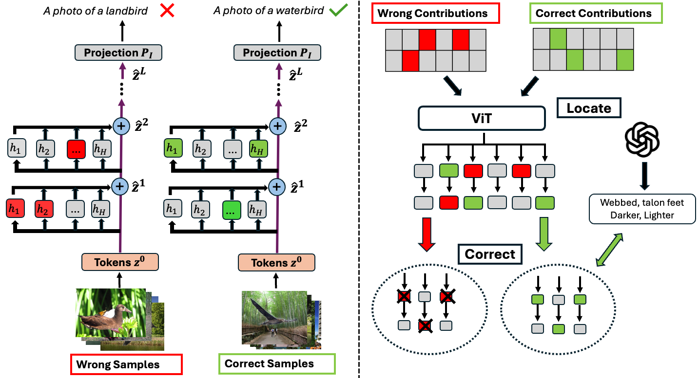
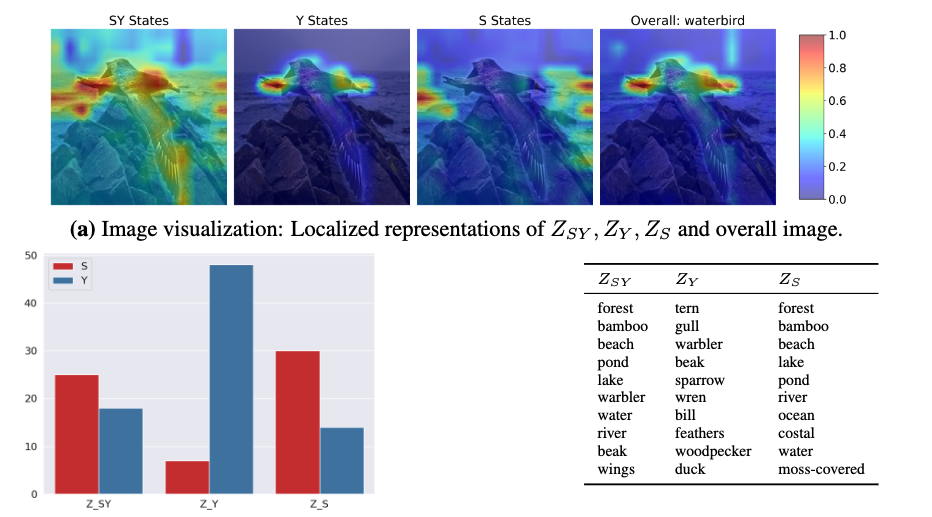

# Debiasing CLIP: Interpreting and Correcting Bias in Attention Heads



This work is adapted from **Interpreting CLIP's Image Representation via Text-Based Decomposition** https://github.com/yossigandelsman/clip_text_span

The models supported are `ViT-B-16, ViT-L-14 and ViT-H-14`, datasets: `binary_waterbirds, genderbias, fairface and counteranimal`. Use this in the arguments below.

# Setup
Install via the requirements.txt file by running `pip install -r requirements.txt`

# Dataset installation
Set your image_dir in the `root` variable in `dataset/data_utils.py`

To download the **Waterbirds** datasets, run:
```python
wget https://nlp.stanford.edu/data/dro/waterbird_complete95_forest2water2.tar.gz
tar -xf  waterbird_complete95_forest2water2.tar.gz
```

For **GenderBias**, follow https://github.com/GenderBiasVL/GenderBias-VL and download `xl_generate_base.tar.gz` from https://huggingface.co/datasets/xiaoyisong/GenderBias-VL/tree/main, store it and untar under `root` and change the name to `genderbias_xl`

For **CounterAnimal**, download from https://counteranimal.github.io/

For **Fairface**, download from https://github.com/joojs/fairface?tab=readme-ov-file, we use padding=1.25

# Retreiving Attention States
Retrieve and store attention states from each head and layer from the CLIP model.

Run the following instructions by changing `dataset, model, batch_size` accordingly. For **fairface**, you do not need to run the second line, as it is automatically set to use the test-set, we do not need the train set:
```python
python compute_prs.py --dataset binary_waterbirds --model ViT-B-16 --batch_size 16
python compute_prs.py --dataset binary_waterbirds --model ViT-B-16 --batch_size 16 --test
```

# Generating text features 
The text features for `genderbias_xl` and `counteranimal` are already in `output_dir`. If you like to re-create them, just create a file with the name `api_key.py` and store your api key inside to call GPT4o.

# Get Results
For **Background Bias** - Waterbirds and CounterAnimal

Run:
```python
python main_bg.py --dataset binary_waterbirds --model ViT-B-16
```

For **Gender bias** - GenderBias and Fairface

Run:
```python
python main_gender.py --dataset genderbias --model ViT-B-16
```

The results include baselines as well. RoboShot/LTC/Ortho-Cali. All base image representations are the same, decomposed into separate layers of attention and MLP activations. Summing all the layers up is equivalent to the overall image representation.

# Visualization 



For Text, the captions are stored under `output/caption`, once again if you want to recreate just delete them and create the api key. Run: 
```python
python viz_text.py --dataset genderbias --model ViT-B-16
```

For Image, you have to re-run `compute_prs.py` but with `visualize_img` flag, this stores the N image patches which were otherwise summed up without the flag and also only store specific layer-head corresponding to either SY, S or Y. Since storing BxNxLxHxD is too memory-intensive. Afterwards run:
```python
python viz_img.py --dataset genderbias --model ViT-B-16
```
